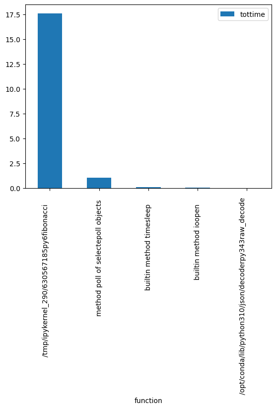

# Mini-Challenge 1 - High Performance Computing (hpc) FS23

## Containers, Communication Patterns/Frameworks and Performance Analysis

You have a client that continuously accumulates data and wants to process it further. To do this, the client wants to use the [Apache Kafka - Data Streaming Platform](https://kafka.apache.org/) in a first step. In a a second step it will use a different communication pattern. The application runs distributed in different Docker containers. Define what kind of data your client has and what problem they want to solve with it. Describe the initial situation and the problem to be solved. Then implement your methods according to the tasks below. Write a short report and answer the questions of each of the 3 parts bellow. Include meassurements/plots where meaningful.

### Part 1: Kafka Cluster and Application Setup

1. Set up Kafka locally on your computer, e.g. according to [this Kafka tutorial](https://github.com/mneedham/basic-kafka-tutorial.git). 
Note, the Docker Compose file available in the repository contains more containers than in the linked source repository.

2. Start the existing Docker containers for the Kafka cluster (Kafka Brokers and Zookeeper) locally on your computer/laptop including a Jupyter notebook. Command line:`$docker-compose up`. Verify e.g. with Docker Desktop if all containers have been started. 

    We start with a Docker compose template, which launches 6 containers:

    * broker-<x> - Kafka brokers
    * zookeeper - is used by Kafka for the leader election
    * Jupyter - Jupyter environment for the connection to our Kafka cluster using notebooks
    * kafdrop - web UI for browsing and monitoring Kafka clusters

    Note: every now and then a broker exits during startup. Just manually restart it.

3. Open the Jupyter notebook. The link to the Jupyter notebook is in the log file of the Jupyter container. The link looks something like this, where the token is individual: http://127.0.0.1:8888/?token=e3cea84dbec991e60795ee749817392f73960184cc5e5c84

4. Run the Kafka tutorial of the notebook. Use [Kafdrop]( https://github.com/obsidiandynamics/kafdrop) to monitor/explore your cluster, topics, and messages. For example, start and stop individual brokers (via Docker Desktop) or change Kafka parameters such as the replication factor and watch how the cluster behaves via Kafdrop.

5. Write two different data generator functions, which regularly send messages containing data. One generator should send messages at least every second (1Hz). Choose yourself which data is sent. The application of the data can be chosen freely, but choose a good mixture of a simple and a complex message. The data should be variable. The data generator can send simulated data or real data. Use suitable Kafka components and meaningful names of functions, variables etc. for the implementation. 

    Tips:
    * Use several notebooks such that you can start and stop the endless loops of data processing individually.
    * After testing, stop the endless loop again otherwise your computer resources are unnecessarily occupied or at the limit.

6. Write a data processor and a data sink. The data processor should regularly read and process the data from the data generators. E.g., a calculation or a machine learning application on the retrieved data; a data enrichment; or the extraction of information from the message. Then the processor sends the data to a data sink. In the data sink the data is stored, e.g. in a CSV file. Use appropriate Kafka components and meaningful names of functions, variables, etc. for the implementation. 
  **ANSWER HARIS**:  
**The data processor loops through the messages and manipulates the data structure. He calculates the n-th fibonacci number recursively and changes the value of the dictionary. I integrated a stop after n message because the runtime took to long.**

1. Draw an overview of your application components including interfaces and data flows, for example using a component diagram. Answer the following questions and interpret your experiments or results: 

      * What are the tasks of the components?
       **ANSWER HARIS** 
      **There are two jupyter notebooks, which are producing and consuming data. between them there are three brokers and one zookeeper which manages the incoming and outgoing requests.**
      * Which interfaces do the components have?
       **ANSWER HARIS** 
      **The jupyter notebooks talk with the consumer and producer class from kafka with python code. For producing data you have to define the topic and the servers, and for consuming you provide the same information.**
      * Why did you decide to use these components?
       **ANSWER HARIS** 
      **Zookeeper: Is necessary in administrating the cluster. Kafka Broker: Is used to store the messages in topics and to send them to the consumers. Jupyter Notebooks: Are a convenient way of creating producers and consumering and debug per section if something doesnt work**
      * Are there any other design decisions you have made? Which requirements (e.g. libraries, hardware, ...) does a component have? **ANSWER HARIS** 
      **I inserted the data as json and consumed it with msg.value.get(). I would not need a separate identifier in Kafka as the data structure provides it.**
      **You need some specific requirements for kafka like kafka-python**

#### Bonus 1
Use other serializers/deserializers instead of JSON for the messages.

### Part 2: Communication Patterns

1. Rewrite your application of part 1 using another communication pattern. You can also use another communciation framework, such as RabbitMQ and/or another underlying messaging protcol such as MQTT.
  **ANSWER HARIS**: **I used RabbitMQ as communication framework and publish subscribe as the communication pattern**
    
2. Pack your rewritten application into containers.
  **ANSWER HARIS**: **See part2/docker-compose.yml**

1. Answer the following questions and interpret your experiments or results: 
      * Which communication pattern is used by Kafka?
       **ANSWER HARIS: Kafka uses publish pull as their communication pattern. On one side is a producer who generates data and on the other site is a consumer which pulls this data**
      * What is the difference compared to your choosen pattern?
       **ANSWER HARIS: The difference in my choosen pattern at Part 2 of this mini-challenge is, that you are a subcriber of a topic and always when a producer produces something you get the data immediately. Whereas with Kafka you have to pull the data, otherwise you get nothing**
      * What are the advantages and disadvantages of these patterns?
       **ANSWER HARIS:  Advantage of Publish-Pull Pattern:  Messages are divided in partitions which allows the parallel consuming and producing of the messages  Disadvantage of Publish-Pull Pattern:  Do not support wildcard topic selection**  
        **Advantage of Publish-Subscribe Pattern:  No complex programming is required to add or remove subscribers to a topic. Thus publish-subscribe systems provide a great deal of scalability and flexibility  Disadvantage of Publish-Subscribe Pattern:  Due to asynchronous interactions, testing is not a matter of making a request and then analyzing the result, thus testing can be challenging.**
      * How can you scale the two different approaches? What are ? Why? What are challenges to be considered?
        **ANSWER HARIS:  For apache kafka you must add brokers to scale out or rebalance data across brokers which are being more heavily used. But pushing new Kafka broker into production can potentially impact performance because moving thousands of partitions to staging can take hours. **
        **For RabbitMQ and the publish-subscribe pattern you can split the queue into multiple queues and distribute them in the cluster to increase throughput. Having multiple clusters**
      * What other 2-3 topologies/patterns do you know used for data processing? Describe the differences and use cases with at least one additional topology. 
        **ANSWER HARIS: Lambda architecture is a way of processing massive quantities of data with a hybrid approach using batch-processing and stream-processing. No infrastructure is a key factor why lambda gets considered, whereas high-troughput, distributed and scalable are the primary reasons why kafka is favored. Another data processing topology is microservice architecture, which means you're building applications of small, independent services that communicate with each other trough APIs**

      * Which pattern suits your chosen application best?
       **ANSWER HARIS: At work we try to switch to RabbitMQ with the publish-subscribe pattern to solve the problem of competing consumers. The current REST API is unable to serve all consumers for a reasonable amount of time, causing consumers to wait too long after a request is made.**

#### Bonus 2
Show how your container setup could be integrated into a container orchestration system (such as Kubernets) and how it would profit from this. Or show how you could replace some of the components with cloud-based offers and what changes/consideradtions come with this.

### Part 3: Performance Analysis and Evaluation

1. Change the scalability of your communication framework by changing the used resources. (E.g.: add brokers and/or zookeepers and play with parameters in the docker-compose file. Use orders of magnited more producers/consumers.) Perform 2-3 experiments with different configurations. 
**ANSWER HARIS:** 
**First Configuration: 4 Consumer, 1 Producer, 3 Brokers & 1 Zookeper** 
**Problems with connecting 2 consumers, but after some time all consumers where possible to retrieve data** 
**Second Configuration: 4 Consumer, 1 Producer, 2 Brokers & 1 Zookeper** 
**Producer slowed down but consuming was still possible** 
**Third Configuration: 4 Consumer, 1 Producer, 1 Broker & 1 Zookeper** 
**Producer paused, 2 consumers stopped immediately and after some time all consumers stopped. Producing was still possible but much slower then before** 

1. Analyze the performance of your application:
    * Data generators/processors: measure the average time incl. standard deviation required by your data generator loop over several runs and loops. Determine a reasonable number of runs and loop executions for the performance analysis.
     **ANSWER HARIS** 
    We see the average time and the standard deviation for 100 runs with a different number of loops. The standard deviation does not change over time. From this we can conclude that the generation of data and its transmission to Kafka is very stable. 
    
     
    * Data generators/processors: determine which call of your processor takes the most time. Which 3 methods are called the most or needed the most time and how much time?
      **ANSWER HARIS**  Neither retrieving nor writing the data to the data sink takes much time. Only the data manupilation function, in my case a recursive Fibonacci function, takes about 18 seconds for 30 elements. 
     
    * Data generators/processors: create a profile of your processor code in a processor.prof file and create 1-2 visualizations of the profile. 
    **ANSWER HARIS**  See visualization above created with cProfile. I had to write a custom function to visualize everything since SnakeViz didn't work on my machine. 

2. Did you detect bottlenecks? Describe and discuss 1-3 detected bottlenecks.  **ANSWER HARIS** The bootlenecks are small groups of brokers with the same number of consumers. As the number of brokers decreases, Kafka throws out more consumers until you increase them again. The speed of the producer also decreases with fewer brokers. In contrast, producing and consuming is very stable with different numbers of producers and consumers. Kafka keeps everything in balance.

#### Bonus 3
Mitigate or produce a bottleneck.

## Reflection

Write a reflection on the realization of the mini-challenge. What went well? Where did problems occur? Where did you need more time than planned? 
What would you do differently in the future? What would you change in the assignment? Give examples in each case. 
**ANSWER HARIS** 
For me, it was very difficult to implement the infrastructure, regardless of the tutorials provided. Issues like creating a different number of consumers consuming at the same time while a producer is producing, and then still understanding the behavior of the framework gave me a headache. I spent most of my time writing the code and trying to make things work before I understood the concept of communication patterns/frameworks. Also, the visualization didn't go well, especially when the standard libraries didn't work on my own computer. In the end, I got something done and understand the behavior of the communication patterns, but a month seems too little to deliver something reproducible. I would rather invest more time in building a framework that works in real life. Also, more code examples that help one answer the questions and analyze the performance properly would be very helpful.
 

## Hints

### Credits

Parts of this mini-challenge are based on: https://github.com/mneedham/basic-kafka-tutorial/.

### Further Resources

* Kafka crash course: https://youtu.be/R873BlNVUB4
* Getting started with Kafka: https://towardsdatascience.com/getting-started-with-apache-kafka-in-python-604b3250aa05
* In-depth Kafka online course: https://www.udemy.com/course/apache-kafka/
* Excelent guide on low level communication patterns: https://zguide.zeromq.org/
